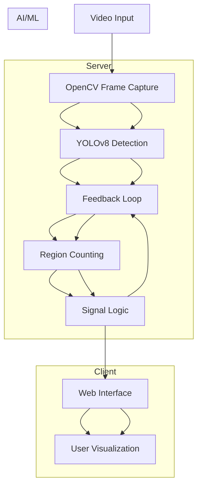

# 🚦 Traffic Monitoring Simulation 🚗


A real-time traffic management system that uses computer vision to optimize signal timing based on vehicle density analysis.

 

## ✨ Key Features

- Real-time vehicle detection using YOLOv8 model
- Multi-zone traffic density monitoring
- Dynamic signal control algorithm: based on vehicle count and round robin
- Vehicle tracking across frames

## 🏗️ System Architecture




## 🛠️ Installation

### Prerequisites
- Python 3.8+
- NVIDIA GPU (recommended for best performance)

### Setup
```bash
# Clone repository
git clone https://github.com/craxh21/Traffic-Monitoring-Simulation.git
cd Traffic-Monitoring-Simulation

# Create virtual environment
python -m venv venv
source venv/bin/activate  # Linux/Mac
# venv\Scripts\activate  # Windows

# Install dependencies
pip install -r requirements.txt

# Download model weights
wget https://github.com/ultralytics/assets/releases/download/v0.0.0/yolov8s.pt -O models/yolov8s.pt
```

## ⚙️ Configuration

Create or modify `config.py` with these parameters:

```python
# Detection Zones (x1,y1, x2,y2)
REGIONS = [
    ((100, 100), (400, 300)),  # Top-left region
    ((450, 100), (800, 300)),  # Top-right region
    ((100, 350), (400, 550)),  # Bottom-left region
    ((450, 350), (800, 550))   # Bottom-right region
]

# Processing Parameters
FRAME_SKIP = 3                 # Process every Nth frame (reduce for better accuracy)
MIN_VEHICLES_FOR_GREEN = 5     # Minimum vehicles required to trigger green signal
SIGNAL_DURATION = 30           # Minimum green light duration (seconds)
DETECTION_CONFIDENCE = 0.6     # YOLO detection confidence threshold
MAX_TRACK_DISTANCE = 35        # Max pixels between frames for tracking
```

## 📊 Performance Benchmarks

### Frame Processing Rates (1080p Input)

| Component           | CPU (i7-11800H) | GPU (RTX 3060) | Notes                     |
|---------------------|-----------------|----------------|---------------------------|
| YOLOv8 Inference    | 6-8 FPS         | 22-26 FPS      | yolov8s.pt model          |
| Vehicle Tracking    | 10-14 FPS       | 28-32 FPS      | Includes counting logic   |
| Web Streaming       | 4-6 FPS         | 18-22 FPS      | End-to-end pipeline       |
| Effective Output*   | 12-18 FPS       | 54-66 FPS      | With FRAME_SKIP=3 applied |

*Actual displayed frame rate after processing skip

### Resource Utilization

| Metric              | CPU Mode       | GPU Mode       | Peak Observations        |
|---------------------|----------------|----------------|--------------------------|
| Memory Usage        | 1.3-1.6GB      | 2.4-2.9GB      | During heavy traffic     |
| CPU Utilization     | 80-95%         | 30-45%         | Per-core distribution    |
| GPU Utilization     | N/A            | 55-70%         | CUDA cores activity      |
| VRAM Consumption    | -              | 3.1-3.8GB      | With model loaded        |

<!--**Notes:**
- CPU Mode: Intel Core i7-11800H @ 2.30GHz (8 cores)
- GPU Mode: NVIDIA RTX 3060 (6GB VRAM)
- Tested with 1920×1080 resolution video
- Performance varies with vehicle density and detection complexity
